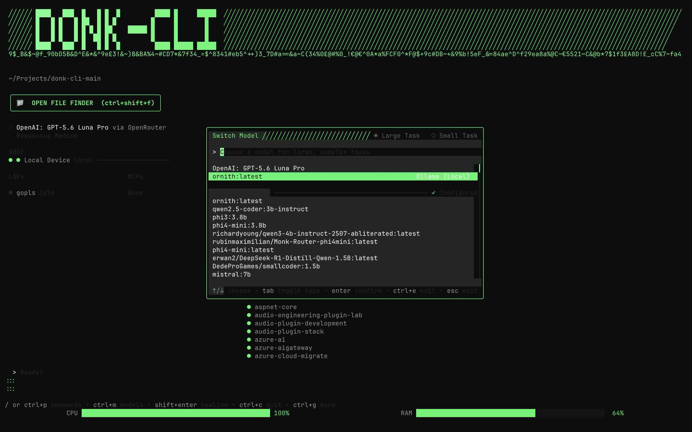
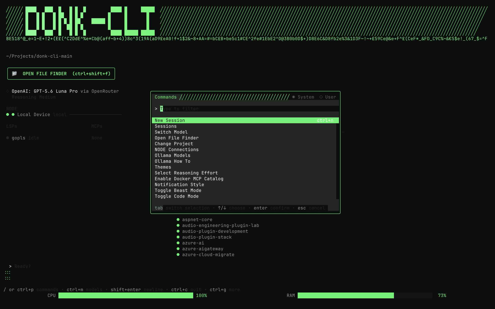
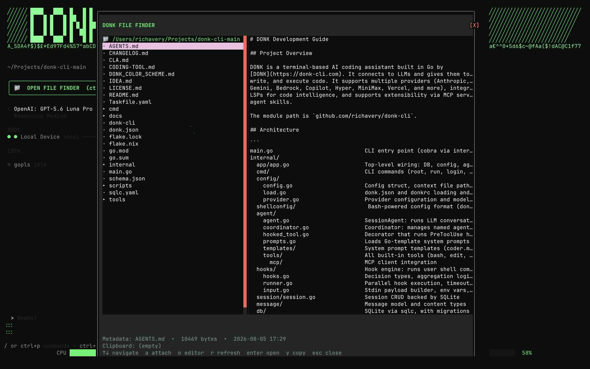
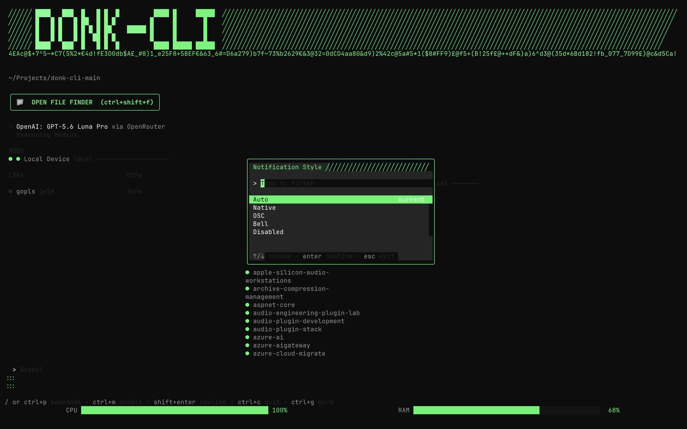
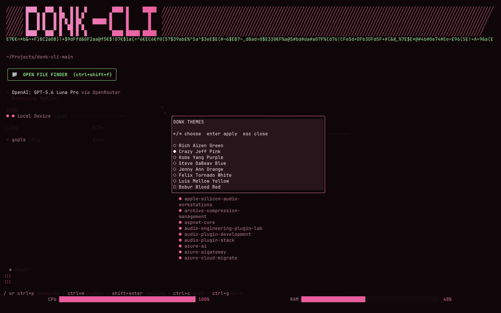
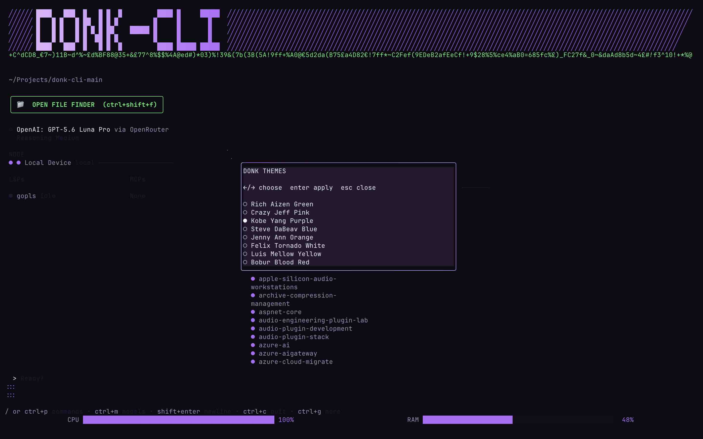
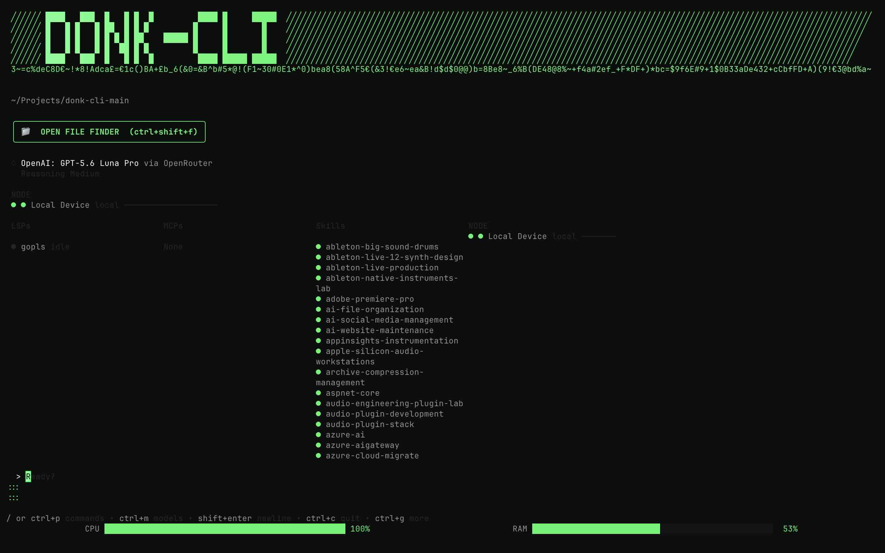

# ◇ BVR-CLI 1.2.0 by Richard Aizen Avery III

**The keyboard-first AI workspace for your projects.**

BVR brings project files, conversations, local models, tools, permissions,
skills, LSPs, and automation into one fast terminal cockpit. Inspect the
workspace, choose the model, and ship.

> **Release 1.2.0:** stability and polish release. The homescreen beaver
> mascot no longer spazzes on every mouse movement (4s pulse + 400ms hover
> debounce), the duplicate NODE section is gone, the `--version` beaver head
> is now in BVR neon green (#3BF66B), and the project is organized with
> `packaging/icons/` and a single `Taskfile.yaml`.


## ⚡ Quick start

For a zero-friction, cross-platform installation directly from GitHub releases:

```sh
curl -sL https://get.bvr-cli.dev/install.sh | bash
bvr auth <LICENSE_KEY>
```

Or see [`docs/installation.md`](docs/installation.md) for detailed platform-specific methods or building from source.

Install the current source build globally:

```sh
./scripts/install-bvr-cli.sh
hash -r 2>/dev/null || true
bvr-cli --version
bvr-cli --help
```

When testing changes, prefer `bvr-cli` from the repo build; if you have an
older global install, update it with the installer above.

## 📦 Install

### macOS

Use the DMG for a normal Mac app experience.

1. Open `dist/bvr-cli_dev_darwin_arm64.dmg`
2. Drag `BVR.app` to `Applications`
3. Double-click `BVR.app`

If macOS blocks it:
- Right-click `BVR.app` → Open
- Or run: `xattr -cr /Applications/BVR.app`

The DMG launcher auto-detects your terminal:
- Ghostty first, then Alacritty, Kitty, WezTerm, iTerm2
- Falls back to Terminal.app

### Windows

Use the EXE/MSI installer or ZIP archive.

### Linux

Use deb/rpm/apk/arch packages, AUR, Nix, or release archives.

See [`docs/ONBOARDING.md`](docs/ONBOARDING.md) for the full onboarding and
installer guide.

## 🧭 Move between projects

```sh
bvr-cli --cwd /path/to/project
```

Inside BVR, use `/cd` or `/project`, select a directory, and press `s`. You can
also type `cd ~/Projects/my-project` into the prompt; BVR switches projects
instead of sending that text to the agent. `bvr-cli projects` lists recent
projects.

## 🧠 Local Ollama models

BVR discovers all models available from Ollama’s local API. Open `/models`,
`/ollama`, or press `Ctrl+L`.

- `r` refreshes local models
- `p` pulls the highlighted model
- `s` starts Ollama when it is offline
- `Enter` selects and warms the model

The model diamond is gray when unknown, purple while loading, green when ready,
and red if loading fails. Read [`docs/OLLAMA_HOW_TO.md`](docs/OLLAMA_HOW_TO.md).



For smaller Ollama coding models such as `qwen2.5-coder:3b-instruct`, use the
fantasy-free native coder. It talks directly to Ollama with a small tool set,
recovers Qwen-style text tool calls, and buffers raw tool-call JSON from the
terminal display:

```sh
GOWORK=off go build -o "$HOME/bin/codetool" ./cmd/codetool
GOWORK=off go build -o "$HOME/bin/bvr-cli" .

BVR_CODETOOL="$HOME/bin/codetool" \
  "$HOME/bin/bvr-cli" code --native \
  --model qwen2.5-coder:3b-instruct --stream \
  "Read the relevant files and fix the failing test"
```

Use `--cwd /path/to/project` when the coding task is in another directory. See
[`docs/OLLAMA_HOW_TO.md`](docs/OLLAMA_HOW_TO.md) for diagnostics and
troubleshooting.

## ✨ What BVR includes

- Branded Bubble Tea TUI with bounded, responsive layouts
- Gradient CPU/RAM resource bars that glow brighter under load
- Brightened status and help text for terminal readability
- In-TUI cursor animation
- Project File Finder with previews, metadata, hidden files, paging, clipboard,
  and project switching
- `[+]` attachment button wired to FILEFINDER for fast file, photo, video, and
  link attachments
- Sessions, model/provider selection, permissions, MCP, LSP, and skills
- Ollama discovery, model pull, automatic startup, and model warm-up
- Agent Skills from default directories including `~/Documents/AI-SKILLS`
- NODE connection support for HTTP/JSON, WebSocket, and SSH transports
- Optional embedded Ghostty shader installation and in-TUI cursor animations
- Persistent project registration and recently accessed project tracking




## 🛠 Developer checks

```sh
gofmt -w .
go test ./...
go vet ./...
go build ./...
```

Cross-compile the beta targets:

```sh
GOOS=darwin GOARCH=arm64 go build -o /tmp/bvr-darwin-arm64 .
GOOS=darwin GOARCH=amd64 go build -o /tmp/bvr-darwin-amd64 .
GOOS=windows GOARCH=amd64 go build -o /tmp/bvr-windows-amd64.exe .
GOOS=linux GOARCH=amd64 go build -o /tmp/bvr-linux-amd64 .
GOOS=linux GOARCH=arm64 go build -o /tmp/bvr-linux-arm64 .
```

## 📦 Install

- **macOS** — use the DMG, Homebrew, or NPM wrapper.
- **Windows** — use the EXE/MSI installer or ZIP archive.
- **Linux** — use deb/rpm/apk/arch packages, AUR, Nix, or release archives.

See [`docs/ONBOARDING.md`](docs/ONBOARDING.md) for the full onboarding and
installer guide.

## 📚 Documentation map

| Document | Use it for |
| --- | --- |
| [`docs/installation.md`](docs/installation.md) | Installation, testing, paths, troubleshooting |
| [`docs/ONBOARDING.md`](docs/ONBOARDING.md) | First-run setup, dependencies, and packaging |
| [`docs/FEATURES-OVERVIEW.md`](docs/FEATURES-OVERVIEW.md) | Full feature inventory for beta/marketing |
| [`docs/IMG-RESOURCES.md`](docs/IMG-RESOURCES.md) | Screenshots, videos, and app icon assets |
| [`docs/PACKAGING.md`](docs/PACKAGING.md) | Release automation and packaging configs |
| [`docs/ABOUT.md`](docs/ABOUT.md) | Company and maintainer contact info |
| [`docs/BETA.md`](docs/BETA.md) | Beta testing program, invites, distribution, and feedback |
| [`docs/OLLAMA_HOW_TO.md`](docs/OLLAMA_HOW_TO.md) | Ollama setup and local models |
| [`docs/SKILLS.md`](docs/SKILLS.md) | Agent Skills discovery and syncing |
| [`docs/FILE_FINDER.md`](docs/FILE_FINDER.md) | File Finder behavior |
| [`docs/SYSTEM_ARCHITECTURE.md`](docs/SYSTEM_ARCHITECTURE.md) | Architecture and roadmap |
| [`docs/UI_BRANDING.md`](docs/UI_BRANDING.md) | BVR visual identity |
| [`docs/MOBILE-CLI.md`](docs/MOBILE-CLI.md) | Mobile companion bridge and iOS/Android plans |
| [`docs/BVR-SERVER.md`](docs/BVR-SERVER.md) | Host-side companion server design |
| [`docs/NODE_TRANSPORTS.md`](docs/NODE_TRANSPORTS.md) | NODE connection setup and transports |
| [`docs/NODE_HTTP_PROTOCOL.md`](docs/NODE_HTTP_PROTOCOL.md) | NODE HTTP/JSON protocol |
| [`docs/NODE_WEBSOCKET_PROTOCOL.md`](docs/NODE_WEBSOCKET_PROTOCOL.md) | NODE WebSocket streaming protocol |
| [`docs/NODE_SSH_TRANSPORT.md`](docs/NODE_SSH_TRANSPORT.md) | NODE SSH transport |
| [`docs/TASKLIST.md`](docs/TASKLIST.md) | Active task tracking |






## 🧪 Beta report checklist

Include:

1. OS and CPU architecture
2. Terminal application
3. `bvr-cli --version` output
4. Exact launch command
5. Project path and whether Ollama was enabled
6. Reproduction steps and terminal output

## 📬 Contact and feedback

- **Maintainer:** Richard Aizen Avery III
- **Email:** averydevz@outlook.com
- **GitHub:** https://github.com/richavery/bvr-cli-main
- **Website:** https://bvr-cli.com

Found a bug or have a feature request? Open an issue on GitHub or reach out by
email. Beta feedback is welcome.

**See the project. Choose your intelligence. Get to work.**