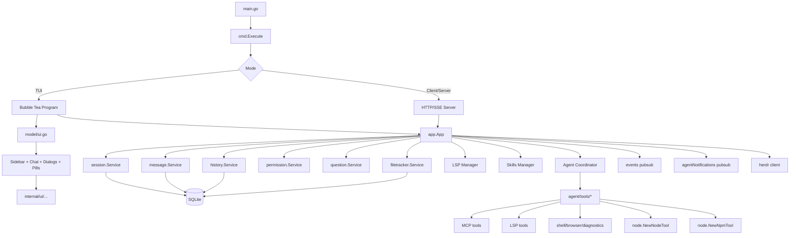
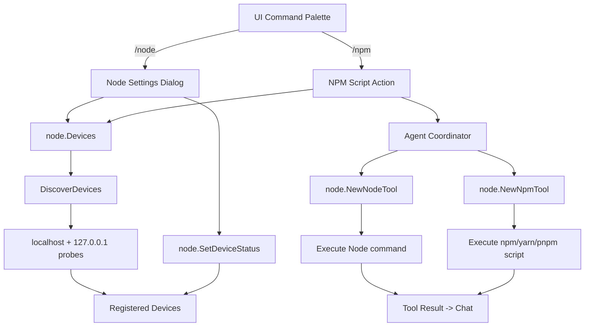
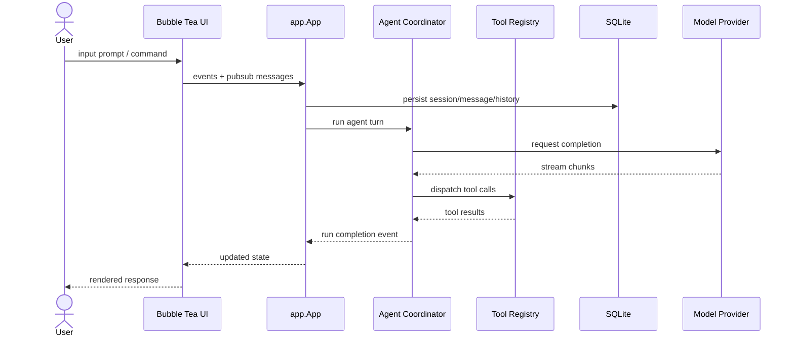

# System Architecture — donk-cli-main

## Overview
`donk-cli-main` is a terminal-native AI coding assistant built in Go. It uses Charm Bubble Tea / Bubbles for the complete UI backbone, SQLite for local persistence, and a layered agent/tool system for model-backed assistance. The project migrates portable features from the old Rust/Python `donk-cli` into this Go master repo one feature at a time.

## App Outline

## NODE Integration

## Runtime Modes

### 1) TUI Mode
- `cmd.Execute()` → `app.New()` → Bubble Tea program
- Full interactive UI with sidebar, chat pane, command palette, file picker, notifications, skills, attachments, diffview, logo, completions, pills
- Tool panels render inside chat/tool windows using Charm primitives

### 2) Client/Server Mode
- `internal/cmd/run.go` + server handlers expose session/model/agent APIs over a Unix socket/named pipe
- SSE streams `runCompletions` for deterministic exit signaling
- Swagger docs describe `/v1` API surface

### 3) Background Services
- LSP manager starts/stops language servers on demand
- Update checker, herdr client, agent notifications broker

## Data Flow

## Package Organization

| Package | Responsibility |
|---|---|
| `main.go` | CLI entrypoint, pprof bootstrap |
| `internal/cmd` | Cobra commands, client/server routing |
| `internal/app` | Service wiring, lifecycle, brokers |
| `internal/ui` | Bubble Tea model/view/update, dialogs, styles |
| `internal/ui/anim` | UI-bound animation helpers + re-exports from `internal/anim` |
| `internal/anim` | Go-native animation library (gallery, spinner, spring, progress) |
| `internal/ui/anim/scenes` | Planned Go scene implementations |
| `internal/agent` | Coordinator, permissions, questions, prompts, notify |
| `internal/agent/tools` | Tool implementations: bash, edit, fetch, grep, LSP, MCP, node, npm |
| `internal/backend` | Backend provider selection |
| `internal/commands` | Command palette + custom/MCP prompt loading |
| `internal/config` | Configuration + overrides |
| `internal/db` | SQLite queries + migrations |
| `internal/session` | Session service |
| `internal/message` | Message service |
| `internal/history` | File/history service |
| `internal/shell` | Shell command execution |
| `internal/lsp` | LSP manager |
| `internal/skills` | Skill discovery + builtin skills |
| `internal/tools` | Tool registry, slash commands, tool panels |
| `internal/health` | Health/service checks |
| `internal/format` | Message formatting + spinner helpers |
| `internal/oauth` | Auth flows: Copilot, Hyper, MCP |
| `internal/server` | HTTP/SSE server |
| `internal/proto` | Protobuf or protocol helpers |
| `internal/pubsub` | Event brokers |
| `internal/workspace` | Workspace/resolution helpers |
| `docs/DONK-ASCII-LOGOS-TEXT.rtf` | Design assets and ASCII logo reference |

## Migration Status

| Feature | Status | Path |
|---|---|---|
| Animation library | In progress | `internal/anim/`, `internal/ui/anim/` |
| Tool registry | Pending | `internal/tools/` |
| Health monitor | Pending | `internal/health/` |
| Ollama/local models | Pending | agent/tools + backend |
| Node integration | In progress | `internal/node` + `internal/agent/tools` |
| NPM script execution | In progress | palette + dialog + agent |
| File finder | Complete | `internal/ui/dialog/filebrowser.go` |
| MCP tools | Existing | `internal/agent/tools/mcp` |
| LSP tools | Existing | `internal/agent/tools/lsp_*` |
| Themes | Verified working | UI styles |

## Design Principles
- CLI-only UI; no Rust chrome, no Alacritty app wrapper
- One feature at a time, fully rewritten in Go unless impossible
- Keep `donk-cli-go` as reference; merge features into `donk-cli-main`
- Catalog references in `REFERENCE.md` with exact paths and reuse notes
- Prefer KISS/DRY, concise, elegant code
- Linear history with rebase, small focused commits
