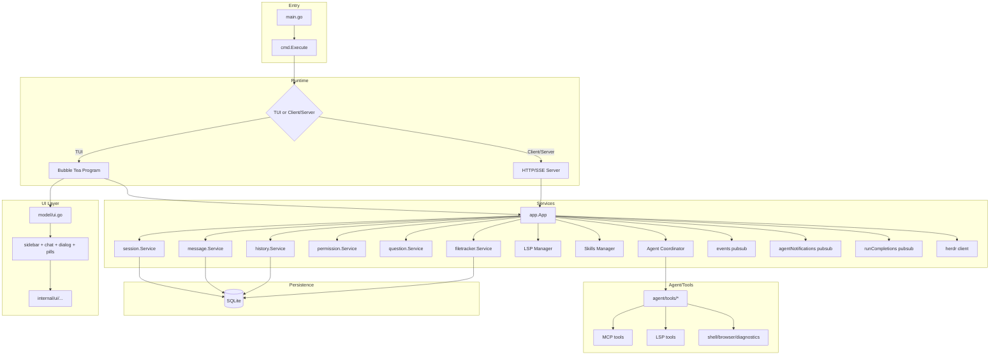
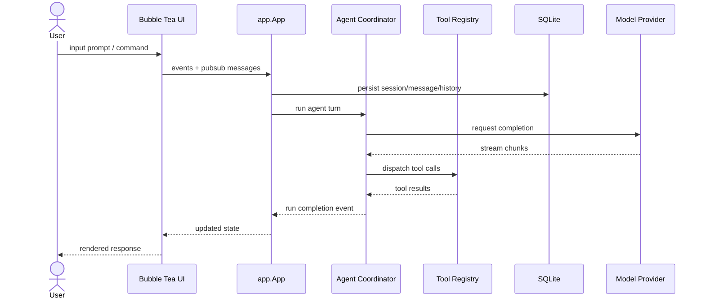

# System Architecture — donk-cli-main

## Overview
`donk-cli-main` is a terminal-native AI coding assistant built in Go. It uses Charm Bubble Tea / Bubbles for the complete UI backbone, SQLite for local persistence, and a layered agent/tool system for model-backed assistance. The project is migrating portable features from the old Rust/Python `donk-cli` into this Go master one feature at a time.

## Tech Stack

| Layer | Technology | Purpose |
|---|---|---|
| Language | Go 1.26 | Primary implementation |
| UI Framework | Bubble Tea / Bubbles / Catwalk / Lipgloss / Glamour / Ultraviolet | Terminal UI, rendering, paging, styling |
| CLI | Cobra | Command routing |
| Persistence | SQLite via `modernc.org/sqlite` + Goose migrations | Sessions, messages, history, permissions |
| Agent | Internal coordinator + MCP SDK | Tool dispatch, run lifecycle, completion events |
| LSP | Internal manager | Language server lifecycle and restarts |
| Shell | `mvdan.cc/sh` interpreter | PTY-backed shell execution |
| MCP | `modelcontextprotocol/go-sdk` | External tool catalog |
| HTTP/RPC | `charmbracelet/x` + Swagger + SSE | Client/server mode, swagger docs |
| AI Models | OpenAI-compatible providers | Chat completions, reasoning effort, thinking mode |
| Clipboard | `golang.design/x/clipboard` | Cross-platform clipboard |
| Animations | `internal/anim` + `internal/ui/anim` | Ported Rust animation presets and scenes |
| Config | Godotenv + internal store | Settings, overrides, working dir |
| Observability | slog + pprof + herdr client | Logging, profiling, pane integration |

## Layout / Runtime Modes

### 1) TUI Mode
- `cmd.Execute()` → `app.New()` → Bubble Tea program
- Full interactive UI with sidebar, chat pane, command palette, file picker, notifications, skills, attachments, diffview, logo, completions, pills
- Tool panels render inside chat/tool windows using Charm primitives

### 2) Client/Server Mode
- `internal/cmd/run.go` + server handlers expose session/model/agent APIs over a Unix socket/named pipe
- SSE streams `runCompletions` for deterministic exit signaling
- Swagger docs describe `/v1` API surface

### 3) Background Services
- LSP manager starts/stops language servers on demand
- DNS init via `_ "github.com/rfaiii/donk-cli-main/internal/dns"`
- Update checker, herdr client, agent notifications broker

## Architecture Diagram

## Data Flow

## Package Organization

| Package | Responsibility |
|---|---|
| `main.go` | CLI entrypoint, pprof bootstrap |
| `internal/cmd` | Cobra commands, client/server routing |
| `internal/app` | Service wiring, lifecycle, brokers |
| `internal/ui` | Bubble Tea model/view/update, dialogs, styles |
| `internal/ui/anim` | UI-bound animation helpers + re-exports from `internal/anim` |
| `internal/anim` | Go-native animation library (gallery, spinner, spring, progress) |
| `old/internal/ui/anim/library/rust-reference` | Original Rust animation sources for future ports |
| `internal/ui/anim/scenes` | Planned Go scene implementations |
| `internal/agent` | Coordinator, permissions, questions, prompts, notify |
| `internal/agent/tools` | Tool implementations: bash, edit, fetch, grep, LSP, MCP |
| `internal/backend` | Backend provider selection |
| `internal/commands` | Command palette + custom/MCP prompt loading |
| `internal/config` | Configuration + overrides |
| `internal/db` | SQLite queries + migrations |
| `internal/session` | Session service |
| `internal/message` | Message service |
| `internal/history` | File/history service |
| `internal/shell` | Shell command execution |
| `internal/lsp` | LSP manager |
| `internal/skills` | Skill discovery + builtin skills |
| `internal/tools` | Tool registry, slash commands, tool panels |
| `internal/health` | Health/service checks (pending) |
| `internal/format` | Message formatting + spinner helpers |
| `internal/oauth` | Auth flows: Copilot, Hyper, MCP |
| `internal/server` | HTTP/SSE server |
| `internal/proto` | Protobuf or protocol helpers |
| `internal/pubsub` | Event brokers |
| `internal/workspace` | Workspace/resolution helpers |
| `old/docs-donk-cli` | Migrated Rust documentation |
| `scripts-donk-cli` | Migrated Rust scripts |
| `reference` | Shared reference material |

## Migration Status

| Feature | Status | Path |
|---|---|---|
| Animation library | In progress | `internal/anim/`, `internal/ui/anim/` |
| Tool registry | Pending | `internal/tools/` |
| Health monitor | Pending | `internal/health/` |
| Ollama/local models | Pending | agent/tools + backend |
| Node integration | Pending | agent/tools or scripts |
| Sys monitor | Pending | internal tools |
| File browser | Existing | internal UI + agent tools |
| MCP tools | Existing | `internal/agent/tools/mcp` |
| LSP tools | Existing | `internal/agent/tools/lsp_*` |
| Themes | Verified working | UI styles |

## Design Principles
- CLI-only UI; no Rust chrome, no Alacritty app wrapper
- One feature at a time, fully rewritten in Go unless impossible
- Keep `donk-cli-go` as reference; merge features into `donk-cli-main`
- Store legacy Rust sources under `old/internal/ui/anim/library/rust-reference/`
- Catalog references in `REFERENCE.md` with exact paths and reuse notes
- Prefer KISS/DRY, concise, elegant code
- Linear history with rebase, small focused commits
