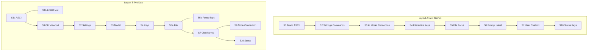

# DONK layout tiles (S1–S10) — index

> **Binding floor plan:** [LAYOUT-FLOORPLAN.md](LAYOUT-FLOORPLAN.md)  
> Agents and PRs **must follow** that document for regions, theme tokens, and W/B/C behavior.

This file is the quick tile index + code gap list. If anything conflicts with the floor plan, the floor plan wins.

Interactive diagram: Cursor canvas `donk-layout-tiles.canvas.tsx`  
Code today: [`crates/donk-tui/src/chrome.rs`](../crates/donk-tui/src/chrome.rs) ≈ **Layout A**

---

## Layout presets

| Preset | Audience | Reference | Shape |
|--------|----------|-----------|-------|
| **A · New** | New users | DESIGN-04 / Gemini | Single column; chat owns `Min(0)` |
| **B · Pro** | Pro users | DESIGN-BOXES | CLI mid-stage + chat \| node split |

---

## Space catalog (summary)

Full contracts (heights, B4, theme) → [LAYOUT-FLOORPLAN.md §3](LAYOUT-FLOORPLAN.md).

| ID | Space | Layout A today |
|----|-------|----------------|
| S1 | Brand / ASCII | `render_brand_header` |
| S2 | Settings & Commands | Tips only (slash dock **gap**) |
| S3 | AI Model + Connection | `render_meta_strip` + Crush busy |
| S4 | Interactive Keys | **gap** (hints folded into S10) |
| S5 | File Focus | `render_file_focus` |
| S6 | Prompt Label | Merged into textarea |
| S7 | User Chatbox | messages + textarea; tools W8 |
| S8 | CLI Viewport | `/terminal` overlay |
| S9 | Node Connection | `/nodes` flow (not persistent pane) |
| S10 | Status / Keys | status bar + keyboard footer |

---

## Behavior codes (pointers)

| Family | Codes | Full table |
|--------|-------|------------|
| Window | W1–W9 | [FLOORPLAN §4.1](LAYOUT-FLOORPLAN.md) |
| Box | B1–B8 | [FLOORPLAN §4.2](LAYOUT-FLOORPLAN.md) |
| Command | C1–C8 | [FLOORPLAN §4.3](LAYOUT-FLOORPLAN.md) |

**B8 fold priority:** S2 → S6 → S4 → S10-keys **before** S7/S8.

---

## Gaps → floor plan (implement in order)

1. ~~S4 interactive keys ribbon (C4/C7)~~ — **shipped 2.5.3**
2. ~~S2 slash command chips (C3)~~ — **shipped 2.5.3**
3. ~~`/layout new|pro|auto` (C8)~~ — denser Layout A; Layout B stub
4. Named `TileId` / constraint builder enforcing B8
5. Layout B: persistent S8 + S9 fly-in

---

## Design assets

| Asset | Path |
|-------|------|
| DESIGN-04 | `ref/cli-design/DONK-CLI-DESIGN-04.png` |
| BOXES | `ref/cli-design/DONK-DESIGN-BOXES.png` |
| **Crush layout** | `ref/cli-design/DONK-CRUSH-LAYOUT.png` → [CRUSH-CHROME.md](CRUSH-CHROME.md) |
| Logo stills | `ref/cli-design/donk-ascii1.png` … `donk-ascii4.png` |
| Mockups | `ref/cli-design/DONK-CLI-DESIGN-0*.png` |
| Crush `.mov` | `ref/cli-design/crush-cli-animations.mov` |
| Anim PDF | [terminal_animation_guide.pdf](terminal_animation_guide.pdf) |
| ASCII | `ref/ascii/DONK-ASCII-TXT.txt` |

See also: [ANIMATIONS.md](ANIMATIONS.md), [ASCII-LOGOS.md](ASCII-LOGOS.md), [ROADMAP.md](../ROADMAP.md), [ref/README.md](../ref/README.md).
