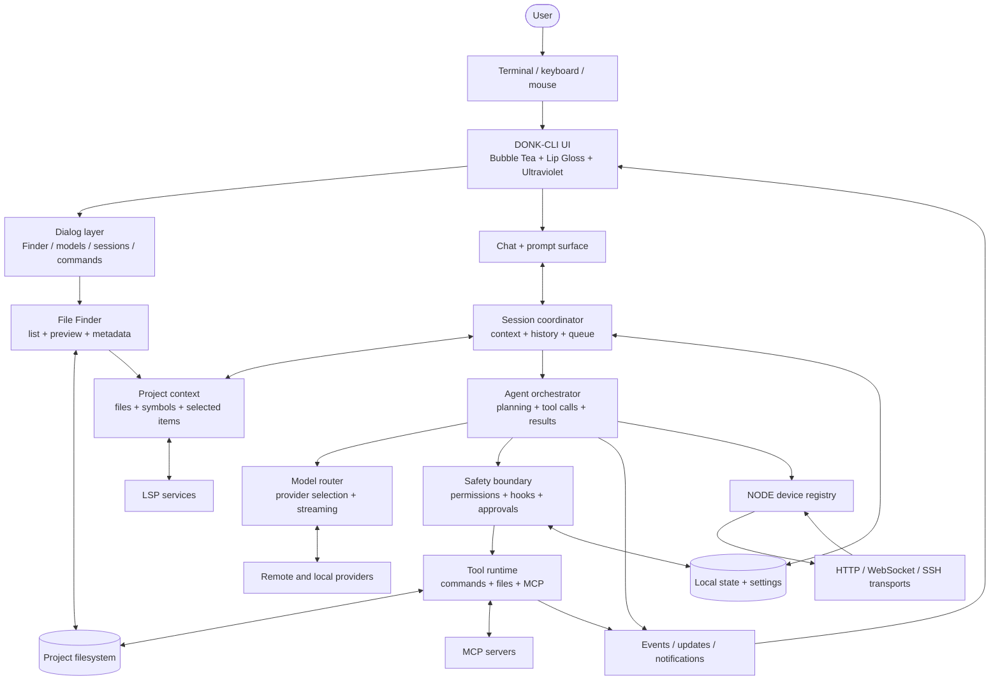
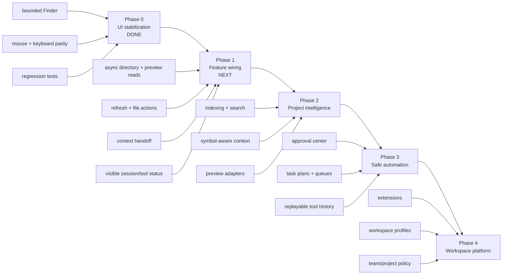

# DONK-CLI System Architecture & Roadmap

This document is the working map for DONK-CLI. It describes the current
boundaries, the direction of data flow, and the order in which new features can
be added without destabilizing the terminal UI.

## North-star product

DONK-CLI is a project-aware terminal workspace. The UI is the durable surface;
sessions, tools, models, project files, and local state plug into it through
explicit boundaries. A user should be able to see what the system knows, choose
what it can do, and recover from every operation.

## System diagram



## Connection contracts

| Boundary | Responsibility | Stability rule |
| --- | --- | --- |
| Terminal → UI | Input events and screen dimensions | Every interactive region needs a bounded hitbox. |
| UI → Dialogs | Focus, modal routing, and rendering | Dialogs must not mutate unrelated UI state. |
| Finder → Files | Directory reads and preview reads | Reads must eventually move off the update path. |
| Finder → Context | Selected paths and preview context | Context handoff must be explicit and cancellable. |
| Session → Agent | Conversation history and queued work | Session state remains the source of truth. |
| Agent → Models | Model choice, prompt, streaming response | Provider differences stay behind the router. |
| Agent → Guard → Tools | Requested action and approval | No tool bypasses permissions or hooks. |
| Components → State | Durable settings and session metadata | UI rendering must remain usable if state is unavailable. |
| Events → UI | Progress, results, errors, notifications | Updates must be non-blocking and render-safe. |

## Rendering rules

The terminal is a constrained canvas, not an elastic document. New UI follows
these rules:

1. Calculate the outer rectangle before rendering content.
2. Subtract borders, padding, and reserved rows before calculating pane sizes.
3. Normalize and clip arbitrary text before styling it.
4. Draw independent panes into hard rectangles; do not rely on composed ANSI
   rows to clip themselves.
5. Derive mouse hitboxes from the final rectangles used to draw controls.
6. Add a regression test for long tokens, narrow terminals, and resized layouts.

The File Finder is the reference implementation of this contract. See
[`FILE_FINDER.md`](FILE_FINDER.md) for its detailed clipping and rollback notes.

## Current repository shape

```text
main.go
  └── application bootstrap

internal/ui/
  ├── model/       root Bubble Tea model, layout, events, header, sidebar
  ├── dialog/      modal surfaces, commands, sessions, Finder, permissions
  ├── chat/        conversation rendering and prompt behavior
  ├── common/      shared terminal/layout primitives
  ├── logo/        DONK wordmark and banner treatments
  └── styles/      theme and visual tokens

internal/
  ├── agent/       orchestration and session-facing agent behavior
  │   └── tools/    tool coordination and tool-facing adapters
  ├── backend/     model/provider and backend integration
  ├── permission/  permission requests and approvals
  ├── config/      settings and configuration loading
  ├── db/          local persistence
  ├── session/     session history and state
  ├── skills/      skill discovery, embedding, and agentskills.io catalog
  ├── lsp/         language-server integration
  └── workspace/   project, LSP, and context services
  └── node/        device registry, transports, health, and execution
```

## Feature roadmap



### Phase 0 — UI stabilization (complete)

- Stable branded terminal surface.
- Finder with bounded panes, clipping, scrolling, mouse selection, metadata,
  clipboard state, and directory navigation.
- Regression coverage for control-heavy and long unbroken content.
- Documentation and rollback notes for layout-sensitive code.

### Phase 1 — Feature wiring (in progress)

- Move directory and preview I/O off the UI update path.
- Add refresh/reload and explicit loading/error states.
- Send selected files and Finder actions into project context.
- Make session, model, tool, and permission state visible while work runs.

The first two items are now implemented in the Finder. Directory and preview
commands run asynchronously, carry sequence/path identity, and ignore stale
results when the user navigates quickly. Press `r` to refresh the current
directory; the footer and metadata region expose loading state while reads are
in flight. Context handoff and richer file actions are implemented.

### NODE transport milestone

The NODE layer now has one device registry and three transport adapters. HTTP
provides authenticated request/response execution and health checks. WebSocket
shares the same agent listener for persistent connections and streamed stdout or
stderr. SSH supports password/private-key authentication, `known_hosts`
verification, safe remote command quoting, and streaming output. Transport
credentials stay outside `Device` records. The home screen and NODE settings
dialog render device names with grey offline, red error, and green online
states. Protocol details are in [`NODE_TRANSPORTS.md`](NODE_TRANSPORTS.md).

### Phase 2 — Project intelligence

- Incremental project indexing and search.
- LSP-backed symbols and focused context selection.
- File-type preview adapters that preserve the clipping contract.

### Phase 3 — Safe automation

- Approval center for pending actions.
- Queued plans and resumable work.
- Auditable, replayable tool history with clear failure recovery.

### Phase 4 — Workspace platform

- Extension points for integrations and project-specific workflows.
- Workspace profiles and reusable layouts.
- Team/project policy surfaces that remain understandable in a terminal.

## Decision log

- **Native dialog:** keeping the Finder inside the main Bubble Tea program gives
  one focus model, one event path, and one theme.
- **Independent pane draws:** composed ANSI rows are unsafe for arbitrary file
  content because control sequences and long tokens can reflow unexpectedly.
- **Full-height Finder:** the open Finder owns the available vertical workspace;
  this gives previews room and hides the large banner without changing global
  header behavior.
- **Incremental roadmap:** feature wiring comes after UI stabilization so new
  asynchronous work has a reliable visual surface to report into.

## Daily closeout checklist

Before stopping work on a subsystem:

```text
[ ] implementation matches the relevant architecture boundary
[ ] docs explain the user-visible behavior and the rollback point
[ ] focused tests pass
[ ] gofmt / static checks pass
[ ] full tests or an explicit reason they were not run
[ ] roadmap updated if the next dependency changed
```